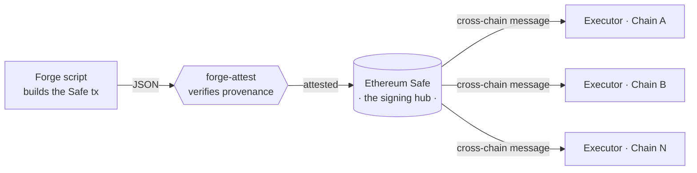

# xsafe

**One Ethereum multisig. Control on any destination chain.**

---

## The idea

Multichain protocols end up with a governance mess: a separate multisig on every
chain, each with its own signers, nonces, and signing rituals. Every extra signing
surface is another place to get phished, fat-finger a payload, or lose quorum.

**xsafe collapses that to one signing hub.** A single [Safe](https://safe.global)
on Ethereum is the source of authority; its approved actions are carried to any
destination chain and executed there. You sign once, on the chain you trust most —
operations land everywhere.

The hard part isn't the messaging — it's **trust in what you sign**. If an operator
builds a transaction with a script in one repo and submits it to the Safe in another,
how does a signer know the thing in the queue is exactly what the script produced, and
wasn't altered in between? That gap is where xsafe starts.

## Building blocks

| Repo | What it does | Status |
|------|--------------|--------|
| [**forge-attest**](https://github.com/xsafe/forge-attest) | Proves a submitted Safe transaction is byte-for-byte the output of a specific Forge script, at a pinned commit — reproduced, hashed three independent ways, and checked against the live Safe queue. | ✅ Available |
| [**forge-attest-example-safe-ops**](https://github.com/xsafe/forge-attest-example-safe-ops) | Reference "producer" repo: a deterministic Forge script that builds a Safe tx, verified by forge-attest. | ✅ Available |
| Cross-chain executor | Home-chain Safe → destination-chain execution over a messaging layer. | 🚧 In progress |

## Principles

- **Don't trust, verify.** Every artifact is reproducible and independently checkable.
  Provenance is derived, never asserted.
- **One signing surface.** Fewer multisigs, fewer nonces, fewer ways to be tricked.
- **Composable, not monolithic.** Each piece (provenance, execution, tooling) stands
  alone and is useful on its own.
